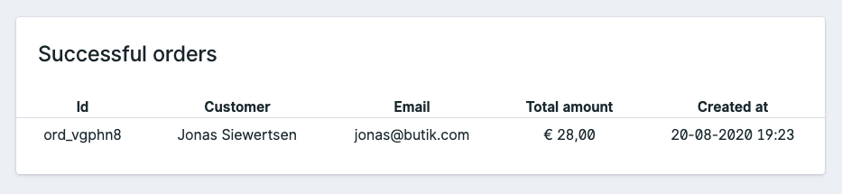

# Widgets

You can add widgets, by adding adding them into the `config/statamic/cp.php` file. 

See more information in the [Statamic docs](https://statamic.dev/dashboard#widgets).

### Available Widgets

#### Orders



The orders widget will show you the last successful orders. 

Add it with the `orders` label into the widgets array:

```php
'widgets' => [
    // space for other widgets
    'orders',
    // even more widgets?
 ],
```


