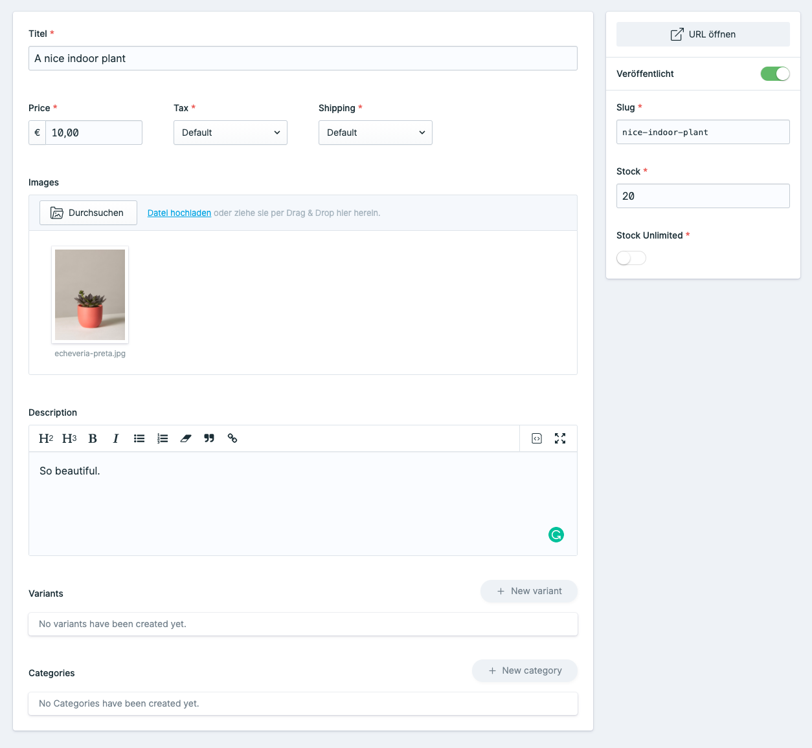

# Products

## How to break everything


Remove those and you will break everything for sure. 


Those are the minimum information _butik_ does need. We need a product price, a tax connected to the product, shipping information. 

## Required product fields

| Field | handle |
| :--- | :--- |
| **Titel** | title |
| **Price** | price |
| **Tax** | tax\_id |
| **Shipping** | shipping\_profile\_slug |
| **Description** | description |

## How to extend products

It's as simple as it gets:

Open the products blueprint inside the control panel and add those fields you want to your product. That's it. 

In case you don't want to use variants or categories, remove those fields. 

