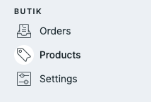
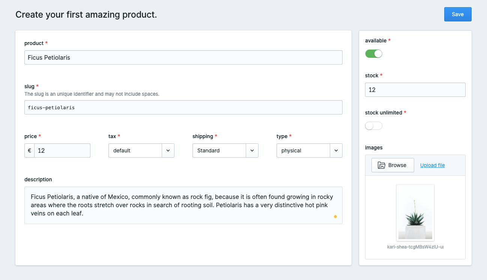
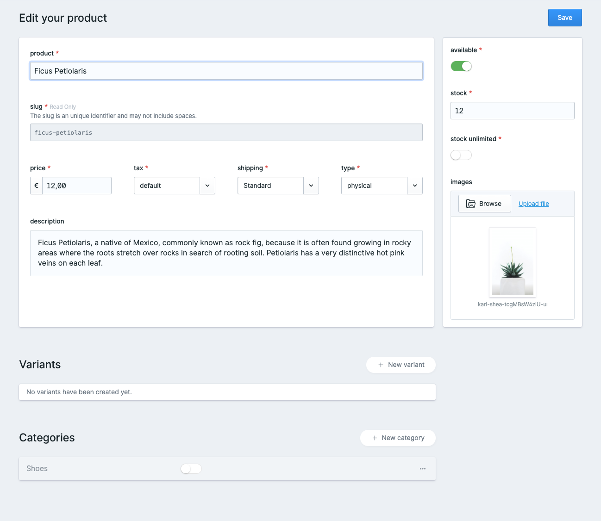
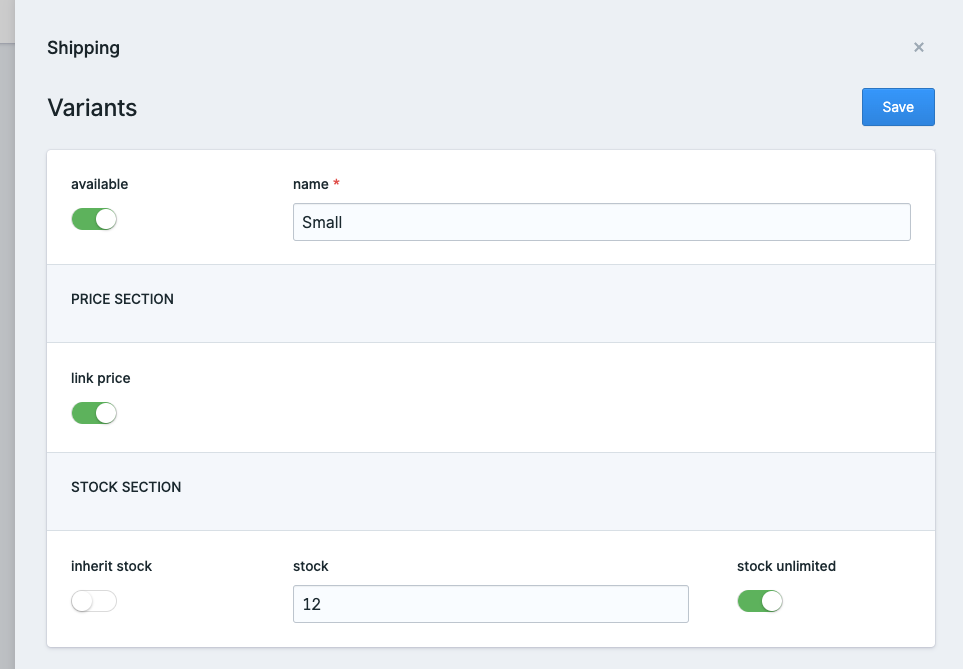
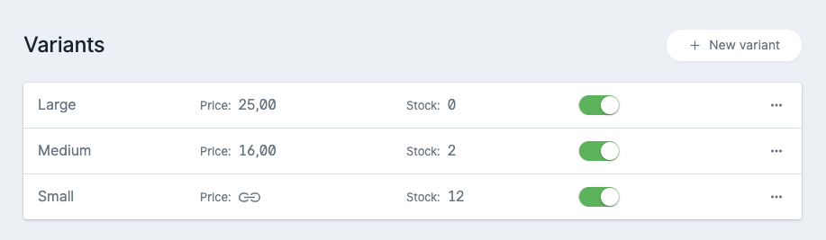
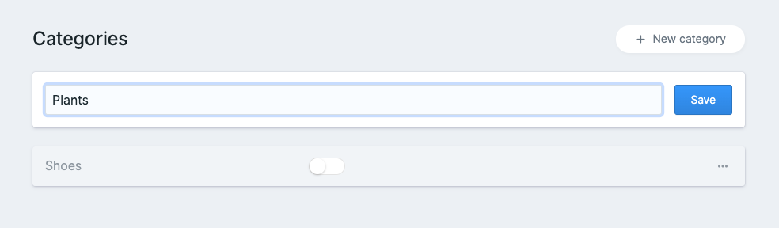
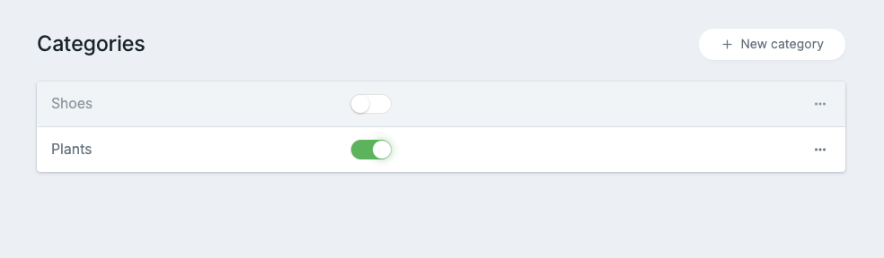

# Products

## Manage

You can manage all of your products and stock in Statamics control panel.

## Create a new product

To create a product, simply fill out all fields marked with a little red star. 

<table>
  <thead>
    <tr>
      <th style="text-align:left">Field</th>
      <th style="text-align:left">Description</th>
    </tr>
  </thead>
  <tbody>
    <tr>
      <td style="text-align:left">product</td>
      <td style="text-align:left">The product name.</td>
    </tr>
    <tr>
      <td style="text-align:left">slug</td>
      <td style="text-align:left">
        
A unique identifier for the product, which will be used to create the
          product url.

        
<em>butik will bark if the slug has already been taken.</em>
        

      </td>
    </tr>
    <tr>
      <td style="text-align:left">price</td>
      <td style="text-align:left">Product price including taxes.</td>
    </tr>
    <tr>
      <td style="text-align:left">tax</td>
      <td style="text-align:left">The <a href="https://butik.dev/configuration/taxes">tax </a>that&apos;s
        added to this product.</td>
    </tr>
    <tr>
      <td style="text-align:left">shipping</td>
      <td style="text-align:left">The <a href="https://butik.dev/configuration/shipping#shipping-profiles">shipping profile</a> connected
        with this product.</td>
    </tr>
    <tr>
      <td style="text-align:left">type</td>
      <td style="text-align:left">Right now there is only <em>physical</em> available. Soon it will be possible
        to sell <em>digital</em> products as well.</td>
    </tr>
    <tr>
      <td style="text-align:left">description</td>
      <td style="text-align:left">The description shown for this product.</td>
    </tr>
  </tbody>
</table>

| Field | Description |
| :--- | :--- |
| available | If deactivated, the product can't be bought and won't show up in the shop. |
| stock | How many items are available. |
| stock unlimited | Is there an unlimited amount of this product available? Be careful with this setting! |
| images | Images will help to sell your product. |

## Edit an existing product

After you saved your product, you will be redirected to the _edit view_ of your product.

This view is nearly identically with the create screen. Variations and categories can be edited from here as well. No hassle jumping to different views to edit a category, variation or similar.  

##  Variants

You can create different variants for your existing products. This might be useful for different cases, like selling T-shirts in different sizes. 

### Create a new variant

| Field | Description |
| :--- | :--- |
| **available** | If deactivated, this variant can not be bought or won't be shown. |
| **name** | Choose a short and unambiguous name for your variant. |
| **link price** | Do you want to **inherit** the price or use another price? |
| **price** | Will only show up if prices are not linked. |
| **inherit stock** | **Do you want to inherit the stock from your parents?** |
| **stock** | **Only visible if not inherited from the parent.** |
| **stock unlimited** | Do you have unlimited products? Be careful with this setting. |

### Manage existing variants

## Categories

Your shop does work perfectly without any categories. In case you\`re having a huge range of products, categories will help your customers find what they need faster. 

### Create a new category

 Simply create a new category when editing your product. 

### Manage existing categories

Use the toggles to connect your product to one or multiple categories. That's really everything there is to it. 


As soon as you add any category, links will get visibly in our default shop templates to browse products in the _belonging_ categories.


