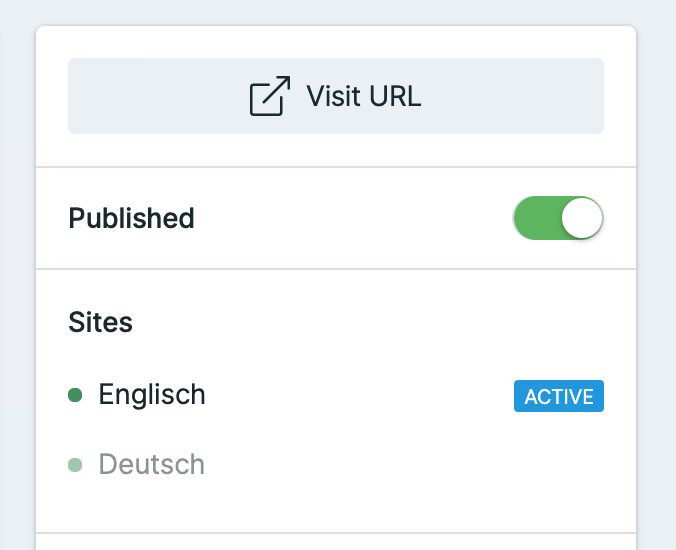

# Localization

You can localize your products, show different information on different sites/languages and translate all existing texts. There are three parts doing this.

## Set up your multisite

It's the first step to set up a multisite: [https://statamic.dev/multi-site\#content](https://statamic.dev/multi-site#content)

## Localize products

If you're multisite has been set up correctly, you can toggle between languages/sites on the right sidebar.


If creating a product in another language, remember to publish the product. 

It's turned off by default. 


## Translate text elements

All text elements have been provided in lang-files and am following the Laravel standard. 

### Publish your language files



### Create a new file for your language

Copy the existing `en.php`  file and rename it correctly to the new language you want to use. 

Laravel is offering great documentation about it:  
[https://laravel.com/docs/8.x/localization](https://laravel.com/docs/8.x/localization)

## How to get to the translated shop

In case your second page url has been named `de` for a german page fx, call `/de/shop`  and you will see your german shop. 

## In case you want to contribute

Did you translate your shop to a not existing language? I would love to offer your translation to other devs by having it in the core. 


It would be amazing if you will PR your translated files to the core to help others.


