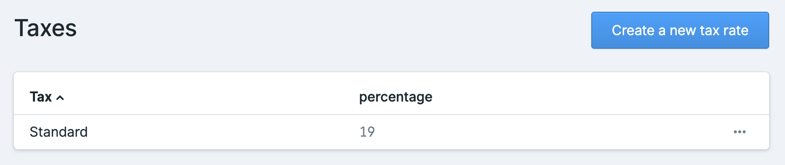
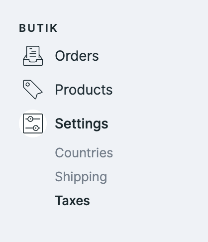

# Taxes

## Getting you started

Before you can add products, you need to set up taxes first. I know taxes are never fun, so inside the install process we should have set up default taxes for your country. 

If needed, you can add more tax rates or edit them of course. 


In case you did set up butik manually, you can easily add your taxes in the butik settings.


### Create or edit taxes

Log into the control panel and go crazy. Make your local tax office proud of your self. 

### Decimal taxes

Are you living in Switzerland or another country with taxes like `7,7%`? No problem!  
You can create taxes with decimal numbers.

